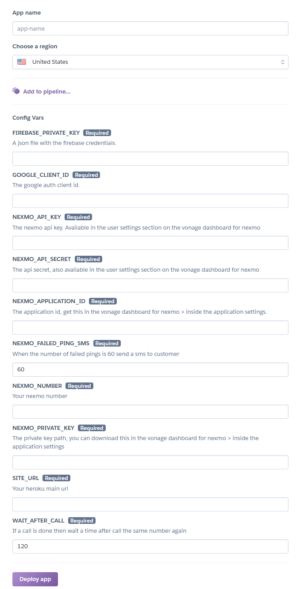

# Scout

[](https://heroku.com/deploy?template=https://github.com/alphacentauri82/scout)

- [Short Description](#short-description)
- [Context](#context)
- [Roadmap](#roadmap)
- [How to](#how-to-build-this-app)
- [Deploying to Heroku](#deploying-to-heroku)
- [Giving thanks](#giving-thanks)
- [Contributing](#contributing)


## Short Description
An app to notify your preferred emergency contacts in case your blood glucose values from Nightscout are  out of range.
This app uses the Vonage messages and voice api's and is written in Flask.

If your values are out of range (significantly low or high) You will get a phone call alerting you and reading your blood glucose over the phone. In the event of not answering the call your preferred emergency contact(s) will receive an SMS notifying them you are out of range

## Context

I have type 1 diabetes. With all the amazing open source initiatives, this is a good way to notify my contacts should i become unresponsive due to being too high or too low. All the data comes from my nightscout dasbhoard:(If you want to check my blood glucose values in real time go to https://dianux.superdi.dev)


Although the initial state of this app is very basic, it's work in progress and you're more than welcome to contribute. The idea is to add more configuration options and improve the UI.


## Roadmap

This project has evolved a lot since it was first developed. The current roadmap includes the following: 

✅ Available

🚧 Work in progress

- ✅ **Scout:** A Python app that reads data from users CGM dashboard (an OSS solution called nightscout receiving data from CGM sensors). In here you configure your own number, an emergency contact and up to 5 additional emergency contact numbers. If blood sugar levels are out of norm, it will call you first -most people can get warning of a low like that- and if you don’t pick up, it will call your emergency contact, if the first one doesn’t pick up, it goes through all of them. Should no one pick up, they will all get a text message alerting about the situation.

- 🚧 A better and cheaper DIY IoT component(a revision of [LimiTTer](https://github.com/JoernL/LimiTTer) to add to Abbot Freestyle libre 2 sensors to turn them into a continuous glucose monitors. These are particularly cheaper and are the choice for diabetics in LATAM.

- 🚧  **Scout Tracker:** GPS LoRa tracke with a WisBlock, I can pair the data from my monitoring app and broadcast through LoRaWan. Removing the dependence on mobile internet. If I’m out of range or in a remote area I can keep broadcasting my blood glucose data, which works with the python app but also adds GPS tracking. If levels are out of norm, the calls will happen but all contacts will get a message with precise location in case of emergency.
I have learned so much throughout this year and it’s definitely a privilege to be able to help the DIY diabetes community. This is the community that saved me from having to wake up everyday at 2am, the people who helped me handle calculating ratios etc.
When a person is diagnosed, doctors just give you a sliding scale and you have to figure out your ratios in a trial and error basis which causes a lot of horrible lows, until you figure out the right amount of insulin, and even then, this constantly changes so we are never in full control. Now with all these monitoring tools we can prevent lows/highs which are dangerous (you can die) and stay within range for most of the time.

----------
## How to build this app

[Tutorial here!!](https://nexmo.dev/nightscout)

### Send SMS to get BG Data 

The endpoint defined to manage the SMS Webhook is: /webhooks/inbound-messages

To guarantee the functionality of the integration, users have to send the following message to the number associated with the application -> "Nightscout return the latest blood glucose level entry"

## Deploying to Heroku

Before you start deploying your App using the Heroku Deploy Button. You need to get the nexmo credentials from [Vonage dashboard](https://dashboard.nexmo.com/). Using the firebase console get the [Firebase database secrets](https://firebase.google.com/) and from google cloud get the [google client id](https://console.cloud.google.com/apis/credentials) needed for auth using the client. Two of this credentials could be `filepaths`, but this is not useful at the moment of deploying the application from a repository because of security reasons. That's why we are going to pass the `nexmo application private key` in a single line as a environment variable and the `firebase database secrets` also as a json string in a single line.

Download your private key file from the communications dashboard and run the following command:

```
awk 'NF {sub(/\r/, ""); printf "%s\\n",$0;}' ./private.key
```

This command is going to retrieve the private key in a single line.

For the `firebase secrets json` file just put the content in a single line. Copy and paste it in the `FIREBASE_PRIVATE_KEY` field. The content sould look like this:

```json
{"type": "xxxxx","project_id": "xxxxx","private_key_id": "xxxxx","private_key": "xxxxx","client_email": "xxxxx","client_id": "xxxxx","auth_uri": "xxxxx","token_uri": "xxxxx","auth_provider_x509_cert_url": "xxxxx","client_x509_cert_url": "xxxxx"}

```

When clicking on the the deploy button:

[](https://heroku.com/deploy?template=https://github.com/nexmo-community/nexmo-scout)

You will see something like this:



## Giving Thanks

Thanks to [@melveg](https://github.com/melveg) for his continued support and contributions to this project 💜 

Thanks to [@mariacarlinahernandez](https://github.com/mariacarlinahernandez) for the SMS to get BG Data feature 💜

## Contributing

All contributions are welcome. Make sure you follow the [code of conduct](CODE_OF_CONDUCT.MD) in this repository. 
